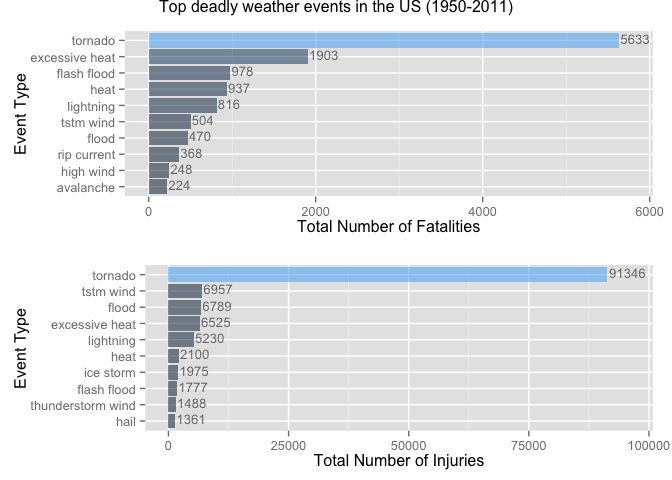
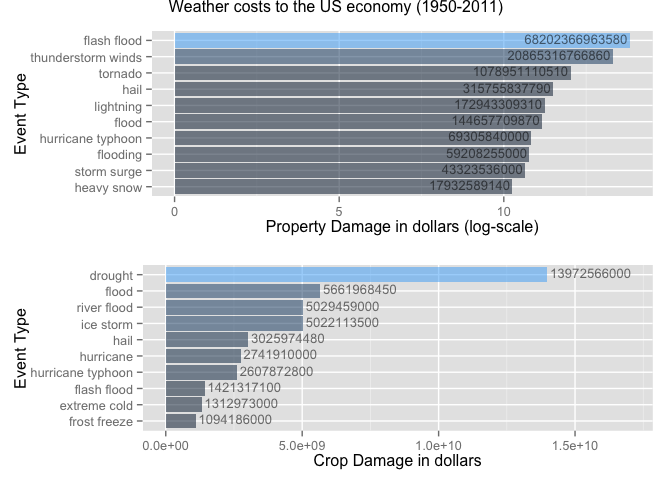

# US Weather Events and the Health & Economics Impacts
Lefteris Nikolidakis  
October 26, 2014  
### Synopsis

The target of this analysis is to find out which metereological events cause the most harmful effects for human health and have the greatest economic consequences in terms of property damage. For the research of given objectives the U.S. National Oceanic and Atmospheric Administration's storm database from the past 60 years was used. It turned out that tornado was the most harmful metereological event which caused over 90000 injuries in the last 60 years and floods had the greatest economic consequences with over 150 billion dollars in property damages.

### Data Processing

The analysis was performed on [Storm Events Database](http://www.ncdc.noaa.gov/stormevents/ftp.jsp), provided by National Climatic Data Center. The data for this analysis come in the form of a comma-separated-value file compressed via the bzip2 algorithm to reduce its size. You can download the file from the course web site:

- [Storm Data](https://d396qusza40orc.cloudfront.net/repdata%2Fdata%2FStormData.csv.bz2) [47Mb]
There is also some documentation of the database available. Here you will find how some of the variables are constructed/defined.

- National Weather Service [Storm Data Documentation](https://d396qusza40orc.cloudfront.net/repdata%2Fpeer2_doc%2Fpd01016005curr.pdf)

- National Climatic Data Center Storm Events [FAQ](https://d396qusza40orc.cloudfront.net/repdata%2Fpeer2_doc%2FNCDC%20Storm%20Events-FAQ%20Page.pdf)

The events in the database start in the year 1950 and end in November 2011. In the earlier years of the database there are generally fewer events recorded, most likely due to a lack of good records. More recent years should be considered more complete.  

The first step is to read the data into a data frame:

```r
download.file("https://d396qusza40orc.cloudfront.net/repdata%2Fdata%2FStormData.csv.bz2", 
              destfile = "StormData.csv.bz2", method = "curl")

StormData <- read.csv(bzfile("StormData.csv.bz2"))
```
Before the analysis, the data need some preprocessing. Event types don't have a specific format. For instance, there are events with types Frost/Freeze, FROST/FREEZE and FROST\\FREEZE which obviously refer to the same type of event.

```r
# translate all letters to lowercase
EventTypes <- tolower(StormData$EVTYPE)
# replace all punct. characters with a space
EventTypes <- gsub(pattern = "[[:blank:][:punct:]+]", replacement = " ", x = EventTypes)
#[:blank:]  Space and TAB characters only.
#[:punct:]  Punctuation symbols . , " ' ? ! ; : # $ % & ( ) * + - / < > = @ [ ] \ ^ _ { } | ~
#The plus sign + indicates there is one or more of the preceding element - blank and/or puct. 

# update the data frame
StormData$EVTYPE <- EventTypes
```

### Harmful Events with respect to Population Health

To find the most harmful event types, the number of casualties are aggregated by the event type:


```r
library(plyr)
casualties <- ddply(StormData, .(EVTYPE), summarize,
                    fatalities = sum(FATALITIES),
                    injuries = sum(INJURIES))
head(casualties)
```

```
##                  EVTYPE fatalities injuries
## 1                                0        0
## 2    high surf advisory          0        0
## 3         coastal flood          0        0
## 4           flash flood          0        0
## 5             lightning          0        0
## 6             tstm wind          0        0
```

```r
#the empty ENVTYPE was '?' before.

# Events that caused most death and injury
FatalEvents <- head(casualties[order(casualties$fatalities, decreasing = T), ], 10)
InjuryEvents <- head(casualties[order(casualties$injuries, decreasing = T), ], 10)
```
  
Top 10 events that caused largest number of deaths:

```r
FatalEvents[, c("EVTYPE", "fatalities")]
```

```
##             EVTYPE fatalities
## 741        tornado       5633
## 116 excessive heat       1903
## 138    flash flood        978
## 240           heat        937
## 410      lightning        816
## 762      tstm wind        504
## 154          flood        470
## 515    rip current        368
## 314      high wind        248
## 19       avalanche        224
```
Top 10 events that caused most number of injuries:

```r
InjuryEvents[, c("EVTYPE", "injuries")]
```

```
##                EVTYPE injuries
## 741           tornado    91346
## 762         tstm wind     6957
## 154             flood     6789
## 116    excessive heat     6525
## 410         lightning     5230
## 240              heat     2100
## 382         ice storm     1975
## 138       flash flood     1777
## 671 thunderstorm wind     1488
## 209              hail     1361
```

### Economic Consequences of Weather Events

To analyze the Economical impact of the weather events, I will use the Property Damage and Crop Damage reportings.  
In the raw data, the property damage is represented with two variables, the `PROPDMG` (dollars) and the exponent `PROPDMGEXP` (symbols indicating the power). Similarly, the crop damage is represented with `CROPDMG` and `CROPDMGEXP`.  
The first step for this part of the analysis, is to calculate the property and crop damage for each event:

```r
names(StormData)
```

```
##  [1] "STATE__"    "BGN_DATE"   "BGN_TIME"   "TIME_ZONE"  "COUNTY"    
##  [6] "COUNTYNAME" "STATE"      "EVTYPE"     "BGN_RANGE"  "BGN_AZI"   
## [11] "BGN_LOCATI" "END_DATE"   "END_TIME"   "COUNTY_END" "COUNTYENDN"
## [16] "END_RANGE"  "END_AZI"    "END_LOCATI" "LENGTH"     "WIDTH"     
## [21] "F"          "MAG"        "FATALITIES" "INJURIES"   "PROPDMG"   
## [26] "PROPDMGEXP" "CROPDMG"    "CROPDMGEXP" "WFO"        "STATEOFFIC"
## [31] "ZONENAMES"  "LATITUDE"   "LONGITUDE"  "LATITUDE_E" "LONGITUDE_"
## [36] "REMARKS"    "REFNUM"
```

```r
head(StormData$PROPDMG)
```

```
## [1] 25.0  2.5 25.0  2.5  2.5  2.5
```

```r
head(StormData$PROPDMGEXP)
```

```
## [1] K K K K K K
## Levels:  - ? + 0 1 2 3 4 5 6 7 8 B h H K m M
```

```r
#transform the PROPDMG and CROPDMG according their correspoding exp value: 
ExpTrans <- function(e) {
  # h = hundred, k = thousand, m = million, b = billion, '' '-' '?' '+' = The raw number. 
  if (e %in% c('h', 'H'))
    return(2)
  else if (e %in% c('k', 'K'))
    return(3)
  else if (e %in% c('m', 'M'))
    return(6)
  else if (e %in% c('b', 'B'))
    return(9)
  else if (!is.na(as.numeric(e))) # if a digit
    return(as.numeric(e))
  else if (e %in% c('', '-', '?', '+'))
    return(0)
  else {
    stop("Invalid exponent value.")
  }
}

PropDmg_TransExp <- sapply(StormData$PROPDMGEXP, FUN=ExpTrans)
StormData$PropDmg_Trans <- StormData$PROPDMG * (10^PropDmg_TransExp)
CropDmg_TransExp <- sapply(StormData$CROPDMGEXP, FUN=ExpTrans)
StormData$CropDmg_Trans <- StormData$CROPDMG * (10^CropDmg_TransExp)
```

```r
# Economic loss by event type
library(plyr)
EconLoss <- ddply(StormData, .(EVTYPE), summarize,
                   PropDmg = sum(PropDmg_Trans),
                   CropDmg = sum(CropDmg_Trans))
#  Remove events that caused no economic damage
EconLoss <- EconLoss[(EconLoss$PropDmg > 0 | EconLoss$CropDmg > 0), ]

# Events that caused most crop and prop damage:
PropDmg_events <- head(EconLoss[order(EconLoss$PropDmg, decreasing = T), ], 10)
CropDmg_events <- head(EconLoss[order(EconLoss$CropDmg, decreasing = T), ], 10)
```
  
The Top 10 events that caused most property damage (in dollars) are:

```r
PropDmg_events[, c("EVTYPE", "PropDmg")]
```

```
##                 EVTYPE   PropDmg
## 138        flash flood 6.820e+13
## 697 thunderstorm winds 2.087e+13
## 741            tornado 1.079e+12
## 209               hail 3.158e+11
## 410          lightning 1.729e+11
## 154              flood 1.447e+11
## 366  hurricane typhoon 6.931e+10
## 166           flooding 5.921e+10
## 585        storm surge 4.332e+10
## 270         heavy snow 1.793e+10
```
  
Similarly, the events that caused biggest crop damage are

```r
CropDmg_events[, c("EVTYPE", "CropDmg")]
```

```
##                EVTYPE   CropDmg
## 84            drought 1.397e+10
## 154             flood 5.662e+09
## 519       river flood 5.029e+09
## 382         ice storm 5.022e+09
## 209              hail 3.026e+09
## 357         hurricane 2.742e+09
## 366 hurricane typhoon 2.608e+09
## 138       flash flood 1.421e+09
## 125      extreme cold 1.313e+09
## 185      frost freeze 1.094e+09
```

### Results
#### Impact of weather events in Health
The following plots show the top Harmful weather event types:

```r
library(ggplot2)
library(gridExtra)
```

```
## Loading required package: grid
```

```r
p1 <- ggplot(data=FatalEvents,
             aes(x=reorder(x=EVTYPE, X=fatalities), y=fatalities, 
                 fill=fatalities, alpha=0.9, ymax = 5750)) +
  geom_bar(stat="identity") +  # bars represent the y values.
  geom_text(mapping = aes(label = round(fatalities)), hjust=-0.05, vjust=0.3, size = 3.5) +
  # text's size not adjusted in graphs when knited html for unknown reason.
  
  coord_flip() +  # Flipped cartesian coordinates so that horizontal becomes vertical, 
                  # and vertical, horizontal.
  ylab("Total Number of Fatalities") +
  xlab("Event Type") +
theme(legend.position="none") # No legend on the right
# reorder treats its first argument as a categorical variable, and reorders its levels 
# based on the values of a second variable, usually numeric.

p2 <- ggplot(data=InjuryEvents,
             aes(x=reorder(EVTYPE, injuries), y=injuries, fill=injuries, alpha=0.9, 
                 ymax = 96000)) +
  geom_bar(stat="identity") +
  geom_text(mapping = aes(label = round(injuries)), hjust=-0.05, vjust=0.3, size = 3.5) +
  coord_flip() + 
  ylab("Total Number of Injuries") +
  xlab("Event Type") +
  theme(legend.position="none")

grid.arrange(p1, p2, main="Top deadly weather events in the US (1950-2011)")
```

 
  
Tornadoes cause the most number of deaths and injuries among all event types. There are more than 5,000 deaths and more than 90,000 injuries in the last 60 years in US, due to tornadoes. The other event types that are most dangerous with respect to population health are excessive heat (approximately 2000 deaths and 5000 injuries ) and flash floods (approximately 1000 deaths and 5000 injuries).

#### Impact of weather events in Economy
  
The following plot shows the most severe weather event types with respect to economic cost since 1950s:


```r
p1 <- ggplot(data=PropDmg_events,
             aes(x=reorder(EVTYPE, PropDmg), y=log10(PropDmg), fill=PropDmg, alpha=0.7)) +
  geom_bar(stat="identity") +
  geom_text(mapping = aes(label = round(PropDmg)), hjust=1.025, vjust=0.3, size = 3.5) +
  coord_flip() +
  xlab("Event Type") +
  ylab("Property Damage in dollars (log-scale)") +
  theme(legend.position="none")

p2 <- ggplot(data=CropDmg_events,
             aes(x=reorder(EVTYPE, CropDmg), y=CropDmg, fill=CropDmg, alpha = 0.7, 
                 ymax = 17000000000)) +
  geom_bar(stat="identity") +
  geom_text(mapping = aes(label = CropDmg), hjust=-0.04, vjust=0.3, size = 3.5) +
  coord_flip() + 
  xlab("Event Type") +
  ylab("Crop Damage in dollars") + 
  theme(legend.position="none")

grid.arrange(p1, p2, main="Weather costs to the US economy (1950-2011)")
```

 
  
Property damages are given in logarithmic scale due to large value ranges. The data shows that flash floods and thunderstorm winds result the largest property damages among weather-related natural diseasters (Note that, due to untidy nature of the available data, type `flood` and `flash flood` are separate values and should be merged for more accurate data-driven conclusions).

The most severe weather event in terms of crop damage is drought. In the last half century, drought has caused more than 10 billion dollars damage. Other severe crop-damage-causing event types are floods and hails.
